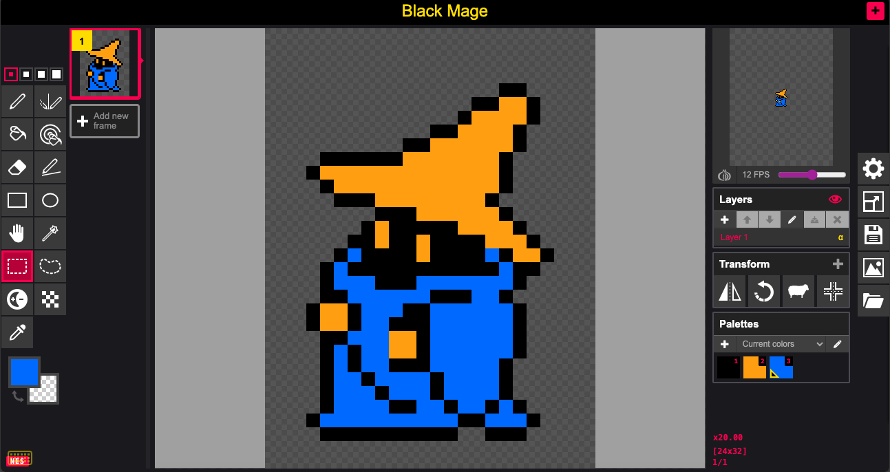

RetroPiskel
===========

Retro console sprite editor - Based on [Piskel](https://github.com/piskelapp/piskel)

RetroPiskel is a fork of Piskel enhanced for creating sprites targeting retro game consoles.
It maintains full compatibility with original Piskel functionality while adding specialized
workflows for retro console development.

## Retro Console Support

### NES / Famicom
- **CHR Export**: Export sprites directly to `.chr` format ([spec](https://wiki.xxiivv.com/site/chr_format.html))
- **NES Mode**: Optional mode that constrains palette to official NES colors
- **4-Color Validation**: Warns when sprites exceed 3 colors + transparent
- **8×8 Tile Alignment**: Dimension validation for proper tile alignment

*More consoles coming soon...*

## About RetroPiskel

### Built with

The Piskel editor is purely built in **JavaScript, HTML and CSS**.

We also use the following **libraries** :
* [spectrum](https://github.com/bgrins/spectrum) : awesome standalone colorpicker
* [gifjs](https://jnordberg.github.io/gif.js/) : generate animated GIFs in javascript, using webworkers
* [supergif](https://github.com/buzzfeed/libgif-js) : modified version of SuperGif to parse and import GIFs
* [jszip](https://github.com/Stuk/jszip) : create, read and edit .zip files with Javascript
* [canvas-toBlob](https://github.com/eligrey/canvas-toBlob.js/) : shim for canvas toBlob
* [jquery](https://jquery.com/) : used sporadically in the application
* [bootstrap-tooltip](https://getbootstrap.com/javascript/#tooltips) : nice tooltips
* [playwright](https://playwright.dev/): End to end testing

As well as some **icons** from the [Noun Project](https://thenounproject.com/) :
* Folder by Simple Icons from The Noun Project
* (and probably one or two others)

### Browser Support

Piskel supports the following browsers:
* **Chrome** (latest)
* **Firefox** (latest)
* **Edge** (latest)
* **Brave** (latest) but **only if canvas fingerprinting is disabled** ([more info](https://github.com/piskelapp/piskel/wiki/About-canvas%E2%80%90based-browser-fingerprinting-and-Brave-browser))

### Mobile/Tablets

There is no support for mobile.

### Offline builds

Offline builds are available. More details in the [dedicated wiki page](https://github.com/piskelapp/piskel/wiki/Desktop-applications).

## Contributing ?

Help is always welcome !

* **Issues** : Found a problem when using the application, want to request a feature, [open an issue](https://github.com/Unveil-gg/RetroPiskel/issues).
* **Development** : Have a look at the [wiki](https://github.com/piskelapp/piskel/wiki) to set up the development environment (for now, same as original Piskel).

> Note: issues from the original Piskel apply to RetroPiskel. You may work on them if applicable, targeting issues below #1231.

## License

Copyright 2025 Unveil | Copyright 2017 Julian Descottes

Licensed under the Apache License, Version 2.0 (the "License");
you may not use this file except in compliance with the License.
You may obtain a copy of the License at

    http://www.apache.org/licenses/LICENSE-2.0

Unless required by applicable law or agreed to in writing, software
distributed under the License is distributed on an "AS IS" BASIS,
WITHOUT WARRANTIES OR CONDITIONS OF ANY KIND, either express or implied.
See the License for the specific language governing permissions and
limitations under the License.
